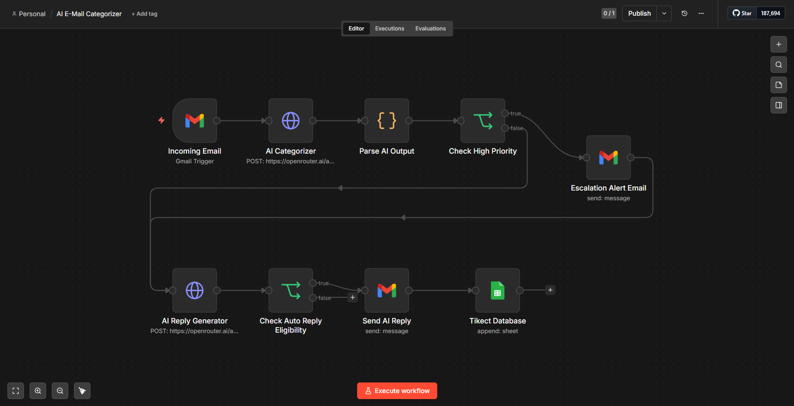

# AI Email Support Automation

An AI-powered customer support workflow built with n8n and OpenRouter that automatically categorizes incoming emails, detects priority levels, generates AI-powered customer replies, logs tickets to Google Sheets, and escalates high-priority support issues.

---

# Workflow Overview

This project simulates a real-world customer support automation system.

The workflow:

```text
Incoming Email
↓
AI Categorization
↓
Priority Detection
↓
AI Reply Generation
↓
Google Sheets Ticket Logging
↓
High Priority Escalation Alerts
```

The system is designed to automate repetitive support operations while still allowing high-risk cases to be escalated for manual review.

---

# Features

- AI email categorization
- Priority detection (High / Medium / Low)
- AI-generated customer support replies
- Gmail integration
- Google Sheets ticket logging
- High-priority escalation alerts
- Automated workflow orchestration using n8n
- Structured AI JSON parsing

---

# Tech Stack

- n8n
- OpenRouter API
- GPT OSS 120B
- Gmail API
- Google Sheets API
- JavaScript (n8n Code Node)

---

# Workflow Screenshot



---

# Workflow Architecture

```text
Incoming Email
↓
AI Categorizer
↓
Parse AI Output
↓
Check High Priority
├── TRUE
│     ├── Escalation Alert Email
│     └── Ticket Database
│
└── FALSE
      ↓
AI Reply Generator
      ↓
Send AI Reply
      ↓
Ticket Database
```

---

# Example AI Classification

## Customer Email

```text
I have contacted support multiple times already. Refund my money immediately or I will file a complaint.
```

## AI Output

```json
{
  "category": "Refund",
  "priority": "High"
}
```

---

# Example AI Reply

```text
Hello,

I’m sorry to hear about your experience and understand your frustration. I appreciate you bringing this issue to our attention.

I will make sure your concern is reviewed as quickly as possible and assist you through the refund process.

Thank you for your patience.
```

---

# Setup Instructions

## 1. Install n8n

Official Website:

https://n8n.io

---

## 2. Configure Gmail OAuth

- Create Google Cloud Project
- Enable Gmail API
- Configure OAuth Consent Screen
- Create OAuth Credentials
- Connect Gmail account inside n8n

---

## 3. Configure OpenRouter API

Create account:

https://openrouter.ai

Generate API key and replace:

```text
YOUR_OPENROUTER_API_KEY
```

inside the workflow.

---

## 4. Configure Google Sheets

- Create spreadsheet
- Connect Google Sheets account in n8n
- Update spreadsheet ID in workflow

---

## 5. Import Workflow

- Open n8n
- Import workflow JSON
- Configure credentials
- Activate workflow

---

# Google Sheets Columns

Recommended columns:

| Sender | Subject | Email | Category | Priority | Time |
|---|---|---|---|---|---|

---

# Security Notes

Before uploading publicly:

- Remove API keys
- Remove OAuth credentials
- Remove personal email addresses
- Remove private spreadsheet IDs

Never commit secrets to GitHub.

---

# Future Improvements

- CRM integration
- Human approval before auto-send
- Sentiment analytics dashboard
- Vector database / RAG integration
- Multi-language support
- SLA breach monitoring
- Customer history tracking
- Slack or Discord escalation alerts
- Knowledge base integration

---

# Project Goals

This project was built to:

- Learn workflow automation
- Understand AI-powered operations
- Practice API integration
- Simulate real-world support systems
- Build portfolio-ready automation projects

---

# Author

Built by Sumon Deb.

---

# License

MIT License

